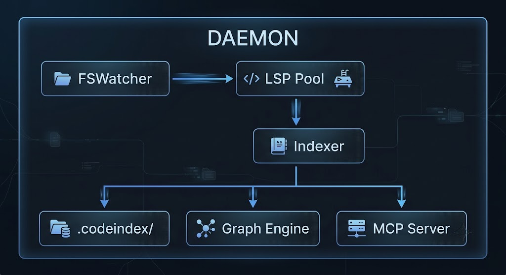

# Codebeacon

> A hierarchical code index for AI coding assistants. Replaces grep + read loops with a relevance-sorted map that always fits in context.

---

## The Problem

AI coding assistants waste tokens. On every task, they run the same cycle:

```
grep for symbol → read file → grep again → read another file → ...
```

On a 500-file repo this is slow. On a 10,000-file repo it overflows the context window before the AI even starts writing code.

Existing tools have real gaps:

| Problem | existing tools | existing tools | Codebeacon |
|---|---|---|---|
| Context window overflow on large repos | ❌ flat map, no hierarchy | ❌ | ✅ hierarchical index, L0 always fits |
| LSP timeout on fresh checkout | — | ❌ (a known issue, a known issue) | ✅ graceful degrade, empty symbols |
| node_modules / vendor indexed | ❌ manual .existing toolsignore | ❌ | ✅ auto-skip + .gitignore |
| Changes missed while daemon offline | ❌ | ❌ | ✅ catch-up index on restart |
| Dependency graph for "what breaks?" | ❌ | ❌ | ✅ BFS on petgraph |

---

## How It Works



1. **FSWatcher** detects file changes with 100ms debounce
2. **LSP Pool** fetches symbols via system-installed LSP binaries (rust-analyzer, gopls, pylsp, etc.)
3. **Indexer** writes a hierarchical `.codeindex/` and updates a petgraph dependency graph
4. **MCP Server** exposes 5 tools for AI to query on demand

The AI loads `index.json` (~500 tokens) at session start. When it needs more, it drills down — no more grep loops.

### Relevance Scoring

When you open files, Codebeacon runs BFS from those files through the dependency graph:

| Hop distance | Score |
|---|---|
| 0 — your file | 1.0 |
| 1 hop away | 0.5 |
| 2 hops | 0.25 |
| 3+ hops | 0.1 |

`index.json` is always sorted by score. Packages below 0.05 are omitted. The map stays small regardless of repo size.

---

## Supported Languages

| Language | LSP Binary |
|---|---|
| Rust | `rust-analyzer` |
| Go | `gopls` |
| Python | `pylsp` |
| TypeScript / JavaScript | `typescript-language-server` |
| C# / Unity | `csharp-ls` |

LSP binaries are not bundled — Codebeacon uses whatever is installed on your system. If a binary is missing, Codebeacon indexes file structure without symbols (graceful degrade).

---

## Installation

```bash
cargo install --git https://github.com/lelorinel/codebeacon
```

Or build from source:

```bash
git clone https://github.com/lelorinel/codebeacon
cd codebeacon
cargo build --release
# binary at target/release/codebeacon
```

---

## Usage

### Build the index

```bash
cd your-project
codebeacon init
# Indexed 445 files → .codeindex/
```

### Start the daemon + MCP server

```bash
codebeacon serve
```

### Claude Code integration

Add to your project's `.mcp.json`:

```json
{
  "mcpServers": {
    "codebeacon": {
      "command": "codebeacon",
      "args": ["serve"]
    }
  }
}
```

Or via CLI:

```bash
claude mcp add codebeacon -- codebeacon serve
```

Claude Code starts `codebeacon serve` automatically when the session opens. The daemon catches up any changes made while it was offline.

---

## MCP Tools

4 tool calls replaces 15+ grep+read cycles:

```
1. get_context(["auth/login.rs"])   ← what am I working with?
2. drill_package("db")              ← dependency I care about
3. find_references("find_user")     ← who calls this?
4. get_dependents("auth/login.rs")  ← what would I break?
```

| Tool | Description |
|---|---|
| `get_context(files)` | Returns relevance-sorted index for currently open files |
| `drill_package(name)` | Full symbol list for a package |
| `find_references(symbol)` | All locations where a symbol is used |
| `find_definition(symbol)` | Definition location and signature |
| `get_dependents(file)` | Files that depend on this file — "what breaks?" |

---

## Index Structure

```
.codeindex/
  index.json        ← Level 0: always loaded (~500 tokens)
  packages/
    auth.json       ← Level 1: per-package detail (on demand)
    db.json
  graph.bin         ← Binary dependency graph (daemon only)
```

`graph.bin` is written on every update. On restart, Codebeacon re-indexes only files changed since the last write — no full re-index needed.

---

## Token Comparison

Tested on a 445-file TypeScript + Rust monorepo:

| Approach | Tool calls | Files read | Tokens (est.) |
|---|---|---|---|
| Claude without Codebeacon | 5+ | 3–10 | ~5,000–8,000 |
| Claude with Codebeacon | 2 | 0 | ~800–1,200 |

---

## License

Codebeacon is open source under the [GNU AGPL v3.0](LICENSE).

If you want to use Codebeacon in a proprietary product without open-sourcing your modifications, a commercial license is available. Contact: **[onur.fidan@outlook.com.tr](mailto:onur.fidan@outlook.com.tr)**
