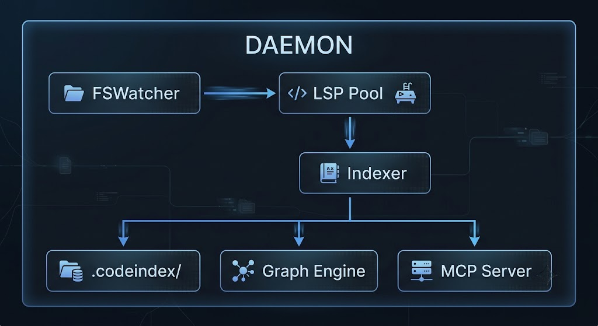

# Codebeacon

> Don't let your AI assistant grep the repo — give it a relevance-sorted map that always fits in context.

**Get started in 3 steps**

1. `cargo install codebeacon` (or `npx codebeacon`)
2. `codebeacon install --platform cursor --project` — offers to run `init` if needed (`--yes` to auto-init)
3. Run `codebeacon serve` in MCP — in every task, call **`get_context`** first (not grep)

If no index exists yet, the AI can call `init_workspace` to build one on demand.

Compact MCP output is on by default (~30% fewer tokens). For local LLMs, set `[compact] enabled = false` in `.codeindex.toml` — see [BENCHMARKS.md](docs/BENCHMARKS.md).

Demo: [`worked/simple-rust/`](worked/simple-rust/) · Install: [INSTALL.md](docs/INSTALL.md) · Tools: [mcp-tools.md](assets/skill/references/mcp-tools.md) · [Changelog](CHANGELOG.md)

---

## What you get

- **Small map** — L0 index ~350–500 tokens; fits large repos without overflow
- **Smart ordering** — packages near your open files rank first (BFS on the import graph)
- **BM25 search** — camelCase/stem tokenization so `auth` finds `authentication` / `user_login`
- **Call graph** — function-level callers/callees; richer `change_impact`
- **Graph queries** — `query`, `path`, `dependents` via CLI or MCP
- **Docs sidecar** — optional markdown index (`--docs`) with heading search and stale tracking
- **Review / risk / arch** — PR diff bundles, logistic risk scores, layer boundary checks, test gaps, dep freshness
- **Multi-agent TUI** — `run-plan` / `multi-agent` with Gallery or Conductor modes

**grep loop:** search → read file → search again → …  
**Codebeacon:** `get_context` → `drill_package` when needed. Token savings: [BENCHMARKS.md](docs/BENCHMARKS.md).

---

## How it works



File changes are parsed (regex by default; optional tree-sitter), imports are resolved into a dependency graph, call sites feed a separate call graph, and a hierarchical `.codeindex/` is written (including BM25 search stats). The MCP server exposes that map on demand — load `index.json` first, drill into packages only when you need detail. LSP is optional and only used for `find_definition` / `find_references`.

---

## Quick reference

### Supported languages

Rust, Go, Python, TypeScript/JavaScript, C# — regex extraction needs no LSP binaries for indexing.

### Essential MCP tools

| Tool | When to use |
|------|-------------|
| `get_context` | Start of every task |
| `drill_package` | Full file and symbol list for one package |
| `find_definition` / `find_references` | Track a symbol |
| `query_context` | BM25 search across packages/files/symbols |
| `navigate_to_feature` | NL → ranked files, read order, related docs |
| `get_dependents` | "What breaks if I change this file?" |
| `call_graph` | Function-level callers / callees |
| `index_status` | Is the index stale? Call before editing |
| `focus_context` | Narrow subgraph around the file you are editing |
| `change_impact` | Blast radius before changing a symbol (files + callers) |
| `review_bundle` | Diff-aware PR / commit review context |
| `arch_check` / `test_gaps` / `predict_risk` / `dep_freshness` | Architecture, tests, risk, dependency drift |
| `query_docs` / `resolve_doc` | Documentation context (when `--docs` / `[docs] path` set) |

### Docs sidecar

```bash
codebeacon init --docs ./docs
codebeacon serve --docs ./docs
```

Indexes markdown headings into `.codeindex/docs.json`. Use `<!-- codebeacon: path -->` links for stale tracking. Details: [CONFIG.md](docs/CONFIG.md#docs) · [mcp-tools.md](assets/skill/references/mcp-tools.md).

### Loop workflow

`loop_begin` → edit → `loop_record` → `loop_tick` → repeat → `loop_end`. Details: [LOOP.md](docs/LOOP.md).

### Parallel agents

When several agents edit the same workspace:

1. `claim_path` (path + your `block_key`) → edit → `release_path`
2. If held: `await_path`, then retry claim
3. If lock tools are missing: **skip** — do not explore MCP catalogs

Batch a plans folder with Cursor, Claude, or Codex (opens a TUI by default — sidebar ✓/spinner, Enter attach, `Ctrl+]` detach, `Q` quit):

```bash
codebeacon run-plan ./plans "implement these"
codebeacon run-plan ./plans "…" --provider claude
codebeacon run-plan ./plans "…" --provider codex --parallel 2
codebeacon run-plan ./plans "…" --headless          # CI / no TUI
codebeacon multi-agent                              # Gallery / Conductor picker
codebeacon multi-agent --mode conductor             # lead + ensemble via MCP
```

Details: [LOCKS.md](docs/LOCKS.md).

Full tool list: [mcp-tools.md](assets/skill/references/mcp-tools.md)

### CLI

```bash
codebeacon init                              # build .codeindex/
codebeacon init --docs ./docs                # + markdown docs sidecar
codebeacon install --platform cursor --project   # editor + MCP; prompts init if missing
codebeacon serve                             # MCP server (add --fs-tools, --security, --docs)
codebeacon docs query "auth"                 # search indexed docs
codebeacon query "auth"                      # BM25 search code index
codebeacon navigate "user login flow"        # NL → files / symbols / docs
codebeacon focus src/auth.rs                 # edit-time subgraph
codebeacon impact login                      # symbol blast radius (+ call fan-in)
codebeacon call-graph find_user              # callers / callees
codebeacon review --base main                # diff-aware review bundle
codebeacon arch-check                        # layer boundary violations
codebeacon test-gaps                         # untested functions
codebeacon predict-risk --file src/auth.rs   # logistic risk score
codebeacon dep-freshness                     # Cargo / npm / go.mod drift
codebeacon loop begin "fix login" --file src/auth.rs
codebeacon run-plan ./plans "implement these"          # TUI multi-agent + path locks
codebeacon run-plan ./plans "…" --provider claude       # Claude Code CLI
codebeacon run-plan ./plans "…" --provider codex        # Codex CLI
codebeacon run-plan ./plans "…" --headless              # CI / no TUI
codebeacon multi-agent                                 # Gallery / Conductor picker
codebeacon multi-agent --mode conductor                # spawn via MCP
codebeacon status                                      # index freshness
codebeacon path src/auth.rs src/db.rs                  # shortest dependency chain
codebeacon report                                      # CODEBEACON_REPORT.md
```

Install for your editor: `codebeacon install --list` — see [INSTALL.md](docs/INSTALL.md).

---

## Optional features

**Multi-repo** — `codebeacon serve --root workspace/` indexes every git repo under that folder. Tool output prefixes paths with the repo name; pass `repo` to scope a call.

**Security gate** — `codebeacon serve --security` or `[security] enabled = true` runs Z3 checks on edit fragments. Hooks + CI: `codebeacon verify`. Details: [SECURITY_EDIT_PATHS.md](docs/SECURITY_EDIT_PATHS.md).

**Local LLMs** — use `--fs-tools` and a system prompt that mandates `get_context`. See [INSTALL.md](docs/INSTALL.md#lm-studio-and-other-local-ai-environments).

**Configuration** — minimal example:

```toml
[compact]
enabled = true

[intelligence]
enabled = true
call_graph = true

[risk]
enabled = true

[deps]
enabled = true
check_registry = false

# [architecture]
# enabled = true
# layers = ["domain", "app", "infra"]

[security]
enabled = false
```

Full schema: [CONFIG.md](docs/CONFIG.md). Optional build: `cargo build --features embeddings` for n-gram `semantic_search`.

---

## Index layout

```
.codeindex/
  index.json        ← Level 0 (~350–500 tokens)
  packages/         ← Level 1 detail (on demand)
  graph.bin         ← file import graph (daemon)
  search.bin        ← BM25 stats
  calls.bin         ← function call graph
  dict.json         ← path refs for compact mode
  docs.json         ← markdown docs sidecar (when --docs / [docs] path)
  locks/            ← multi-agent path claims (apply-locks.json)
```

---

## Documentation

| Doc | Contents |
|-----|----------|
| [INSTALL.md](docs/INSTALL.md) | Platform setup, MCP, hooks, LM Studio |
| [CONFIG.md](docs/CONFIG.md) | `.codeindex.toml` reference |
| [LOCKS.md](docs/LOCKS.md) | Path locks, `run-plan` TUI / `--headless`, `multi-agent` |
| [LOOP.md](docs/LOOP.md) | Loop context coordinator |
| [BENCHMARKS.md](docs/BENCHMARKS.md) | Token savings, relevance scoring, compact mode |
| [SECURITY_EDIT_PATHS.md](docs/SECURITY_EDIT_PATHS.md) | Security coverage matrix |
| [TEAM.md](docs/TEAM.md) · [ROADMAP.md](docs/ROADMAP.md) | Team workflow and roadmap |

---

## License

Codebeacon is open source under the [GNU AGPL v3.0](LICENSE).

Commercial licensing (proprietary use without AGPL obligations): **[onur.fidan@outlook.com.tr](mailto:onur.fidan@outlook.com.tr)**
